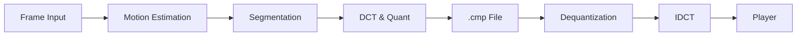

# Foreground/Background Segmented Video Compression


---

## Table of Contents

- [Project Overview](#project-overview)  
- [Features](#features)  
- [Concepts & Algorithms](#concepts--algorithms)  
- [Flow Chart](#flow-chart)
- [Usage](#usage)  
 

---

## Project Overview

This repository implements a **layer-based video encoder and decoder** that separates each frame into **foreground** and **background** regions based on motion, then applies different quantization levels to each layer to improve visual quality in moving regions while aggressively compressing static backgrounds.

---

## Features

- **Block-based Motion Segmentation**  
  – Divide each 16×16 macroblock into foreground or background by analyzing motion vectors (MAD or fast motion estimation).  
- **Layer-aware DCT Compression**  
  – Perform 8×8 DCT on R, G, B channels, quantize DC/AC coefficients with two user-supplied steps (`n1` for foreground, `n2` for background).  
- **Custom .cmp Format**  
  – Stores `n1 n2`, block-type bit, and 64 coefficients per color channel for each 8×8 block.  
- **Decoder with A/V Playback**  
  – Dequantizes using `n1`/`n2`, reconstructs frames, and plays back synchronized video + audio with play/pause/frame-step controls :contentReference[oaicite:4]{index=4}.  

---

## Concepts & Algorithms

1. **Motion Estimation & Macroblock Segmentation**  
   - Compute motion vectors against previous frame.  
   - Group contiguous blocks with similar vectors into foreground objects; identify remaining as background. 
2. **8×8 DCT & Quantization**  
   - Apply 2ⁿ uniform quantization on DCT coefficients (separate tables for foreground/background). :contentReference[oaicite:6]{index=6}  
3. **File I/O & Synchronization**  
   - Parse/write custom `.cmp` files.  
   - Synchronize audio (`.wav`) with decoded frames in a simple A/V player.  

---

## Flow chart


---

## Usage

### Encoder

```bash
python myencoder.py input_video.rgb n1 n2
```

- input_video.rgb — raw RGB frames file (width/height multiple of 16)

- n1 — quantization exponent for foreground blocks

- n2 — quantization exponent for background blocks

- Output: input_video.cmp

```
python mydecoder.py input_video.cmp input_audio.wav
```
- input_video.cmp — compressed video file

- input_audio.wav — raw audio file

- Launches a simple A/V player with play, pause, and frame-step controls

---


